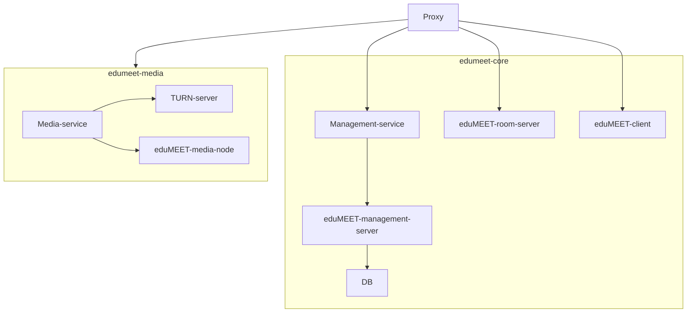
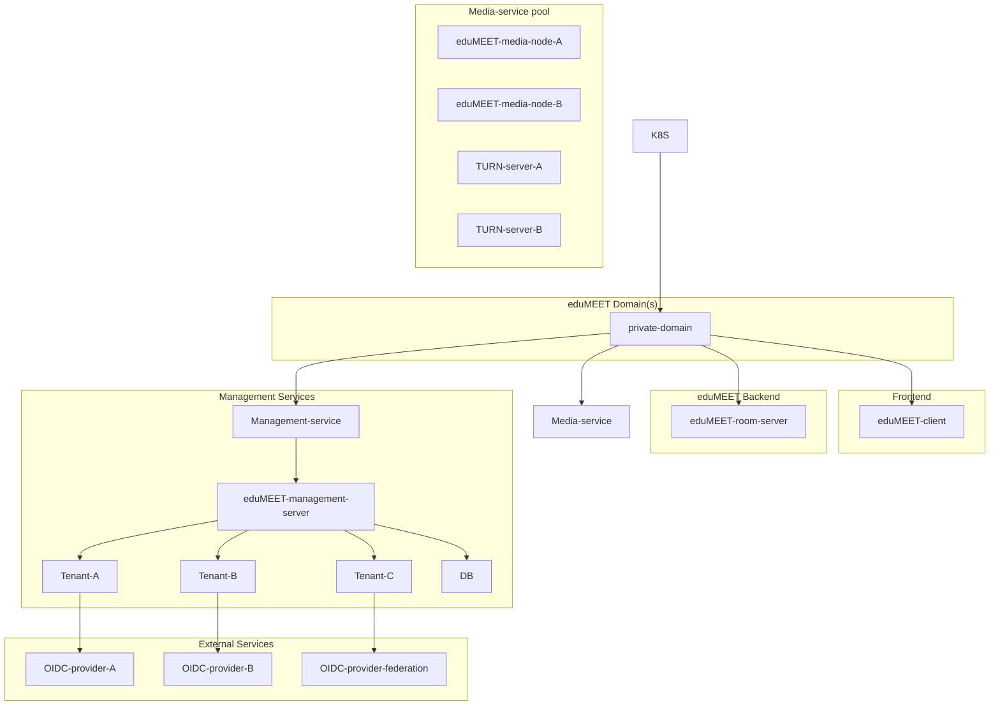

# edumeet-k8s
eduMEET with k8s for version (4.x)

Edumeet simple setup with authentication (by helm files) 

```mermaid
graph TD;
    subgraph "edumeet-core"
        Management-service
        eduMEET-room-server
        eduMEET-client
        eduMEET-management-server
        DB
    end
    Proxy-->eduMEET-room-server;
    Proxy-->eduMEET-client;
    Proxy-->Management-service;
    Management-service-->eduMEET-management-server;
    eduMEET-management-server-->DB;
    subgraph "edumeet-media"
      Media-service-->TURN-server;
      Media-service-->eduMEET-media-node;
    end
    Proxy-->edumeet-media;


```

Edumeet setup (by components)

```mermaid
graph TD;

    subgraph "Frontend"
        eduMEET-client
    end

    subgraph "Media-service pool"
        eduMEET-media-node-A
        eduMEET-media-node-B
        TURN-server-A
        TURN-server-B
    end

    subgraph "eduMEET Backend"
        eduMEET-room-server
    end

    subgraph "Management Services"
        Management-service
        eduMEET-management-server
        Tenant-A
        Tenant-B
        Tenant-C
        DB
    end
    
    subgraph "External Services"
        OIDC-provider-A
        OIDC-provider-B
        OIDC-provider-federation
    end

    subgraph "eduMEET Domain(s)"
        private-domain
    end

    K8S --> private-domain
    private-domain --> eduMEET-room-server
    private-domain --> eduMEET-client
    private-domain --> Media-service
    private-domain --> Management-service

    Management-service --> eduMEET-management-server
    eduMEET-management-server --> Tenant-A
    eduMEET-management-server --> Tenant-B
    eduMEET-management-server --> Tenant-C
    eduMEET-management-server --> DB

    Tenant-A --> OIDC-provider-A
    Tenant-B --> OIDC-provider-B
    Tenant-C --> OIDC-provider-federation

```
