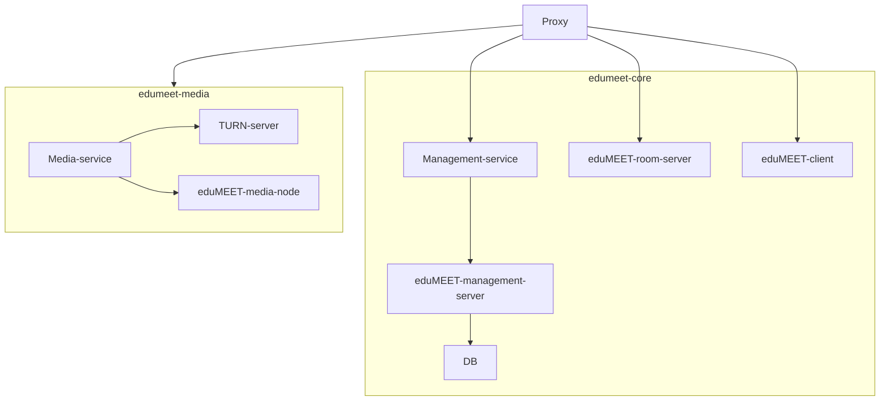
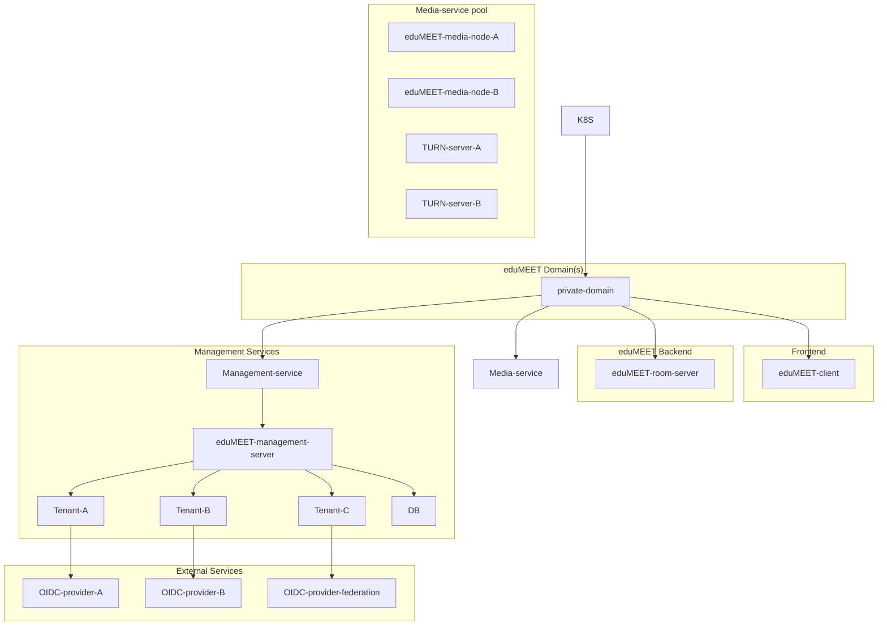

#  with k8s for version (4.x)

This is a "k8s" version of [eduMEET](https://github.com/edumeet/edumeet). 

Install 
```
helm install edumeet-core --values edumeet-k8s/helm/edumeet-core/values.yaml edumeet-k8s/helm/edumeet-core/
helm install edumeet-media --values edumeet-k8s/helm/edumeet-media/values.yaml edumeet-k8s/helm/edumeet-media/
```
Uninstall 
```
helm uninstall edumeet-core
helm uninstall edumeet-media
```
Edumeet simple setup with authentication (by helm files) 



Edumeet setup (by components)

For the authentication to work:

The room server config has to have a management server defined

The edumeet client has to have managementUrl and loginEnabled parameters.

If the default roles are defined in the room server it will be used for an unmanaged room.

There is no current default role options for a tenant, only for a managed room inside of the tenant.

There is an option to define multiple media nodes, the server will ping them periodically and try to load balance between them. 

Changing configuration at the moment requires restart for the room-server/media-node/management-server pods.
